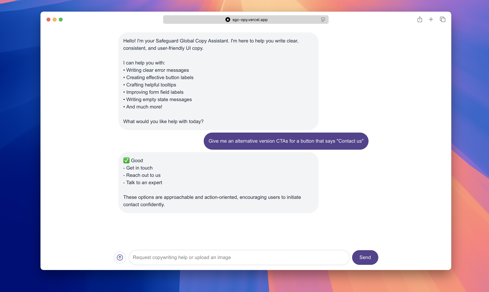

# Safeguard Global Copy Assistant



Safeguard Global Copy Assistant is a modern, responsive web application that helps designers, developers, and product managers write clear, consistent, and human-centered UI copy. It leverages OpenAI's GPT-4o model and is tailored for Safeguard Global's brand, style, and voice guidelines.

## Features
- **Conversational UI:** Chat interface for asking copywriting questions, getting feedback, and refining UI copy.
- **Image Upload:** Drag and drop or upload screenshots for AI-powered copy analysis and suggestions.
- **Brand Alignment:** All responses are aligned with Safeguard Global's brand guidelines, personas, and voice.
- **Apple HIG Alignment:** Copy suggestions are also aligned with Apple Human Interface Guidelines for application design.
- **No Markdown Output:** The assistant outputs plain text for easy copy-paste into your product.
- **Modern Design:** Built with Next.js, Tailwind CSS, and React, with a beautiful, accessible, and responsive UI.

## How to Run Locally
1. Clone the repository.
2. Install dependencies:
   ```sh
   npm install
   ```
3. Add your OpenAI API key to a `.env.local` file:
   ```sh
   OPENAI_API_KEY=sk-...
   ```
4. Start the development server:
   ```sh
   npm run dev
   ```
5. Open [http://localhost:3000](http://localhost:3000) in your browser.

## System Prompt (How the AI is Guided)
The system prompt is a carefully crafted set of instructions and reference material that:
- **Defines the assistant's role** as a copywriting expert for Safeguard Global.
- **Includes full brand information, style guide, personas, and voice** (internal and external) as delimited reference sections.
- **Instructs the AI to:**
  - Always align with Apple Human Interface Guidelines (HIG) for application design.
  - Follow Safeguard Global's brand style, voice, and bullet formatting rules.
  - Write for clarity, consistency, and actionability, reducing cognitive load.
  - Output 2–3 copy variants (each labeled ✅ Good) with a brief explanation.
  - Never use markdown formatting in responses.
  - Be user-first and practical, always asking: "Will this help the user understand and act with confidence?"

This ensures every answer is:
- On-brand
- Persona-aware
- Actionable and easy to use in real product design

---

For more details, see the code in `src/app/api/chat/route.ts` for the full system prompt and reference material.
